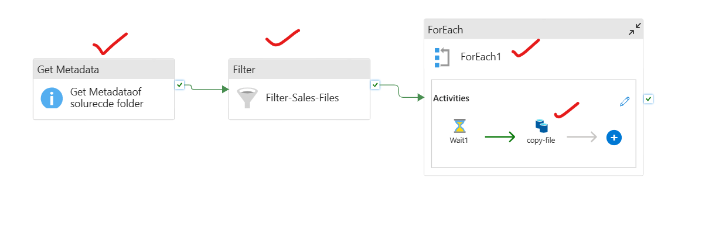

# Azure Data Factory: Copy Files Matching a Specific Name Pattern

---


##  Scenario Overview

**Scenario: Copy Only Daily Sales Files Matching a Date Pattern**

A vendor uploads multiple types of files daily into a single **Azure Blob Storage** `landing` container:

```
landing-or-source/
  ├── sales_20260423.csv        ← ✅ COPY THIS
  ├── sales_20260422.csv        ← ✅ COPY THIS
  ├── returns_20260423.csv      ← ❌ SKIP
  ├── inventory_20260423.json   ← ❌ SKIP
  └── sales_summary.xlsx        ← ❌ SKIP
```

**Goal:** Copy **only** files whose names match the pattern `sales_*.csv` from the `landing` container to the `processed` container — ignoring all other files.

**Why this matters:**  
In real pipelines, landing zones are shared and noisy. Pattern-based filtering ensures your pipeline picks up **exactly the right files** without manual intervention or risky broad copies.

---

## 🏗️ Architecture

```
[Azure Blob Storage : landing-or-source/]
  ├── sales_20260423.csv   ──┐
  ├── sales_20260422.csv   ──┼──► Filter by pattern: sales_*.csv
  ├── returns_20260423.csv  ─┤                │
  ├── inventory_*.json     ──┘          (only matches)
  └── sales_summary.xlsx                      │
                                              ▼
                                 [Get Metadata - childItems]
                                              │
                                              ▼
                                    [Filter Activity]
                                  @startsWith(item().name,'sales_')
                                  @endsWith(item().name,'.csv')
                                              │
                                              ▼
                                    [ForEach Activity]
                                              │
                                              ▼
                                    [Copy Activity per file]
                                              │
                                              ▼
                              [Azure Blob Storage : processed/]
                                ├── sales_20260423.csv
                                └── sales_20260422.csv
```

---

## rerequisites

- **Azure Data Factory** instance (v2)
- **Azure Blob Storage** with two containers:
  - `landing`   — shared drop zone with mixed file types
  - `processed` — clean destination for matched files only
- Linked Service: `LS_AzureBlobStorage`

---

## ️ Step 1: Create Datasets

### 1a. Landing-or-source Container Dataset (for Get Metadata — Folder Level)

1. Go to **Author** → **Datasets** → **+ New Dataset**
2. Select **Azure Blob Storage** → **Binary**
3. Name it `DS_Landing_Folder`
4. Linked Service: `LS_AzureBlobStorage`
5. **Connection tab:**
   - Container: `landing`
   - Leave **Directory** and **File** blank (we're pointing at the folder)
6. **Publish All**


### 1b. Landing-or-Source File Dataset (Parameterized — for Copy Activity Source)

1. **+ New Dataset** → Azure Blob Storage → **Binary**
2. Name it `DS_Landing_File`
3. Linked Service: `LS_AzureBlobStorage`
4. **Parameters tab** → Add:
   - `fileName` | Type: `String`
5. **Connection tab:**
   - Container: `landing`
   - File name → Add dynamic content: `@dataset().fileName`
6. **Publish All**


### 1c. Processed-or-Destination Container Dataset (Parameterized — for Copy Activity Sink)

1. **+ New Dataset** → Azure Blob Storage → **Binary**
2. Name it `DS_Processed_File`
3. Linked Service: `LS_AzureBlobStorage`
4. **Parameters tab** → Add:
   - `fileName` | Type: `String`
5. **Connection tab:**
   - Container: `processed`
   - File name → Add dynamic content: `@dataset().fileName`
6. **Publish All**

>  **Why Binary datasets?**  
> Binary datasets copy files as-is without parsing content — perfect for file movement regardless of format (CSV, JSON, Parquet, etc.).

---


## Step 2: Add Get Metadata Activity (List All Files in Folder)

1. Go to **Author** → **Pipelines** → **+ New Pipeline**
2. Name it `PL_CopyPatternMatchedFiles`
3. Drag **Get Metadata** onto the canvas
4. Name it `GMT_ListLandingFiles`
5. Click the activity → **Settings** tab:
   - **Dataset:** `DS_Landing_Folder`
   - **Field list** → Click **+ New** → Select: `childItems`

> `childItems` returns an **array** of all items (files and folders) in the container.  
> Each item in the array has two properties:
> - `name` — the file name string (e.g., `sales_20260423.csv`)
> - `type` — either `File` or `Folder`

---


## Step 3: Add Filter Activity (Apply the Name Pattern)

1. Drag a **Filter** activity onto the canvas
2. Name it `FLT_MatchSalesCSV`
3. Draw a **Success** arrow: `GMT_ListLandingFiles` → `FLT_MatchSalesCSV`
4. Click the activity → **Settings** tab:

### Items field:
Click **Add dynamic content** and enter:
```
@activity('GMT_ListLandingFiles').output.childItems
```


### Condition field:
Click **Add dynamic content** and enter:
```
@and(
    startsWith(item().name, 'sales_'),
    endsWith(item().name, '.csv')
)
```

> **What this does:**
> - `startsWith(item().name, 'sales_')` → keeps only files beginning with `sales_`
> - `endsWith(item().name, '.csv')` → keeps only files ending with `.csv`
> - `@and(...)` → BOTH conditions must be true — eliminates `sales_summary.xlsx`
---

## 🔄 Step 4: Add ForEach Activity (Iterate Matched Files)

1. Drag **ForEach** onto the canvas
2. Name it `FE_IterateMatchedFiles`
3. Draw a **Success** arrow: `FLT_MatchSalesCSV` → `FE_IterateMatchedFiles`
4. Click the activity → **Settings** tab:
   - **Sequential:** OFF (run in parallel)
   - **Batch count:** `4`
   - **Items** → Add dynamic content:
```
@activity('FLT_MatchSalesCSV').output.Value
```

>  Note: The Filter activity output property is `.output.Value` (capital **V**),  
> unlike Lookup which uses `.output.value` (lowercase v).

---


## 📋 Step 5: Add Copy Activity Inside ForEach

1. Click the **pencil icon (✏️)** on `FE_IterateMatchedFiles` to open the inner canvas
2. Drag **Copy Data** onto the inner canvas
3. Name it `CPY_CopyMatchedFile`

### Source Tab:
- **Dataset:** `DS_Landing_File`
- **Dataset properties:**
  - `fileName` → Add dynamic content: `@item().name`


### Sink Tab:
- **Dataset:** `DS_Processed_File`
- **Dataset properties:**
  - `fileName` → Add dynamic content: `@item().name`


### Settings Tab (Optional):
- Enable **Delete source files after copy** → converts copy into a **move** operation, cleaning up the landing zone

4. Click **← back arrow** to return to the main pipeline canvas

---

##  Step 6: Debug and Validate

### Setup test files in `landing` container:

| File Name | Should Be Copied? |
|---|---|
| `sales_20260423.csv` | ✅ Yes — matches `sales_*.csv` |
| `sales_20260422.csv` | ✅ Yes — matches `sales_*.csv` |
| `returns_20260423.csv` | ❌ No — wrong prefix |
| `inventory_20260423.json` | ❌ No — wrong prefix and extension |
| `sales_summary.xlsx` | ❌ No — wrong extension |
| `SALES_20260421.csv` | ❌ No — `startsWith` is case-sensitive |

### Debug Steps:
1. Click **Debug** in the pipeline toolbar
2. Monitor **Output** panel:
   - `GMT_ListLandingFiles` → output shows 5 `childItems`
   - `FLT_MatchSalesCSV` → output shows 2 filtered items
   - `FE_IterateMatchedFiles` → runs 2 iterations
   - `CPY_CopyMatchedFile` → copies 2 files
3. Verify `processed` container now contains:
   - `sales_20260423.csv` ✅
   - `sales_20260422.csv` ✅

---

##  Full Pipeline View Summary

```
Pipeline: PL_CopyPatternMatchedFiles

[GMT_ListLandingFiles]
  Get Metadata → childItems (all files in landing/)
        │
        ▼ (on success)
[FLT_MatchSalesCSV]
  Filter → @and(startsWith(name,'sales_'), endsWith(name,'.csv'))
        │
        ▼ (on success)
[FE_IterateMatchedFiles]
  ForEach → @activity('FLT_MatchSalesCSV').output.Value
        │
        └─► [CPY_CopyMatchedFile]
              Source: DS_Landing_File  → @item().name
              Sink:   DS_Processed_File → @item().name
```

---

##  Pattern Variation Examples

Different business needs call for different pattern expressions. Here are ready-to-use Filter conditions:

### Match files from today only
```
@and(
    startsWith(item().name, 'sales_'),
    endsWith(item().name, '.csv'),
    endsWith(item().name, concat(formatDateTime(utcNow(), 'yyyyMMdd'), '.csv'))
)
```

### Match any CSV file (any prefix)
```
@endsWith(item().name, '.csv')
```

### Match files containing a keyword anywhere in the name
```
@and(
    contains(item().name, 'sales'),
    endsWith(item().name, '.csv')
)
```

### Match files by multiple valid extensions
```
@and(
    startsWith(item().name, 'sales_'),
    or(
        endsWith(item().name, '.csv'),
        endsWith(item().name, '.parquet')
    )
)
```

### Match files only (exclude subfolders)
```
@and(
    equals(item().type, 'File'),
    startsWith(item().name, 'sales_'),
    endsWith(item().name, '.csv')
)
```

### Match files modified today using Get Metadata inside ForEach
> Use a nested Get Metadata (inside ForEach) on each file with `lastModified` field,  
> then wrap Copy inside another If Condition to check the date.

---

##  Key Expressions Reference

| Expression | Purpose |
|---|---|
| `@activity('GMT_ListLandingFiles').output.childItems` | Array of all files/folders in the container |
| `@activity('FLT_MatchSalesCSV').output.Value` | Array of items that passed the filter (capital V) |
| `@item().name` | File name of the current ForEach iteration |
| `@item().type` | `"File"` or `"Folder"` for current iteration item |
| `startsWith(item().name, 'sales_')` | Checks if name begins with `sales_` |
| `endsWith(item().name, '.csv')` | Checks if name ends with `.csv` |
| `contains(item().name, 'sales')` | Checks if name contains `sales` anywhere |
| `@and(expr1, expr2)` | Both conditions must be true |
| `@or(expr1, expr2)` | Either condition must be true |
| `formatDateTime(utcNow(), 'yyyyMMdd')` | Today's date as `20260423` |

---

##  Common Pitfalls to Avoid

- ❌ **Case sensitivity** — `startsWith('SALES_20260423.csv', 'sales_')` returns `false`. Use `toLower(item().name)` to normalize: `startsWith(toLower(item().name), 'sales_')`
- ❌ **Using `.output.value` (lowercase)** for Filter output — Filter uses `.output.Value` with a capital **V**. Using lowercase causes a null reference error.
- ❌ **Pointing Get Metadata at a file instead of a folder** — The `childItems` field only works when the dataset points to a container or directory, not a specific file.
- ❌ **Not filtering by `type = 'File'`** — If subfolders exist in `landing/`, they appear in `childItems` too. Add `equals(item().type, 'File')` to your Filter condition to avoid errors.
- ❌ **Skipping the Filter activity** — Running ForEach directly on unfiltered `childItems` will attempt to copy every file, including non-target files, causing failures.

---

##  Extension Ideas

| Enhancement | How to Implement |
|---|---|
| Archive after copy | Enable **Delete source files** in Copy Activity sink settings |
| Log copied file names | Add a stored procedure or Append Variable activity after Copy to log each file |
| Alert if no files matched | Add an **If Condition** after Filter: `@equals(length(activity('FLT_MatchSalesCSV').output.Value), 0)` |
| Process files from a specific date range | Add `contains(item().name, '202604')` to filter by month prefix |
| Handle nested subfolders | Use a recursive approach with multiple Get Metadata calls or enable recursive copy in the Copy Activity settings |

---


