# Azure Data Factory — Incremental Data Copy (Watermark Pattern)

---

## 📌 Scenario Overview

**Scenario: Daily Incremental Copy of Orders to ADLS**

A retail company's `dbo.Orders` table in Azure SQL Database receives new inserts and status updates continuously. Instead of copying the entire table on every pipeline run (expensive and slow), the pipeline copies **only the rows that changed since the last run** using a **high-watermark** timestamp column.


[Download SQL scripts file ](adf_incremental_copy.sql)

| Run | Date | Rows copied | What happened |
|---|---|---|---|
| **Run 1** | Apr 20 | 10 rows | Full initial load — watermark seeded at `1900-01-01` |
| **Run 2** | Apr 21 | 5 rows | 3 new orders + 2 status updates |
| **Run 3** | Apr 22 | 3 rows | 2 new orders + 1 cancellation |

**Why this matters:** A full table copy of millions of rows every night is wasteful. The watermark pattern scales linearly with the volume of *changes*, not the total table size.

---
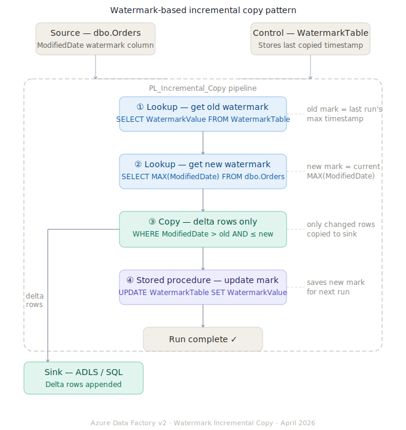


## 🏗️ Architecture Overview

```
[Azure SQL DB]                      [ADLS Gen2 / Sink SQL Table]
  ├── dbo.Orders                        └── orders_delta/
  │     └── ModifiedDate ← watermark          ├── run1_20260420.parquet (10 rows)
  └── dbo.WatermarkTable                      ├── run2_20260421.parquet  (5 rows)
        └── WatermarkValue                    └── run3_20260422.parquet  (3 rows)
              ↑ read before run
              ↑ updated after run

[ADF Pipeline: PL_Incremental_Copy]
  ① LKP_GetOldWatermark   → reads WatermarkTable
  ② LKP_GetNewWatermark   → MAX(ModifiedDate) from source
  ③ CPY_DeltaRows         → WHERE ModifiedDate > old AND <= new
  ④ SP_UpdateWatermark    → writes new max back to WatermarkTable
```

---

## ✅ Prerequisites

- **Azure Data Factory** (v2)
- **Azure SQL Database** with `dbo.Orders` and `dbo.WatermarkTable` (run SQL scripts first)
- **Azure Data Lake Storage Gen2** — container: `incremental`
- Linked Services: `LS_AzureSqlDB`, `LS_ADLS`

---

## 🗄️ Step 1: Run the SQL Setup Scripts

Execute `adf_incremental_copy.sql` in your Azure SQL Database in order:

| Part | What it creates |
|---|---|
| Part 1 | `dbo.Orders` table + `IX_Orders_ModifiedDate` index |
| Part 2 | 10 baseline rows (Run 1 initial load data) |
| Part 3 | 5 delta rows for Run 2 (3 inserts + 2 updates) |
| Part 4 | 3 delta rows for Run 3 (2 inserts + 1 update) |
| Part 5 | `dbo.WatermarkTable` seeded at `1900-01-01` |
| Part 6 | `dbo.usp_UpdateWatermark` stored procedure |
| Part 7 | Helper verification queries |

> ⚠️ Run Part 2 first, then trigger **Run 1** in ADF, then run Part 3 for **Run 2**, etc. This simulates real-world incremental arrivals.

---

## 🔗 Step 2: Create Linked Services

### 2a. Azure SQL Database
1. **Manage** → **Linked Services** → **+ New** → Azure SQL Database
2. Name: `LS_AzureSqlDB`
3. Fill server, database, credentials → **Test** → **Create**

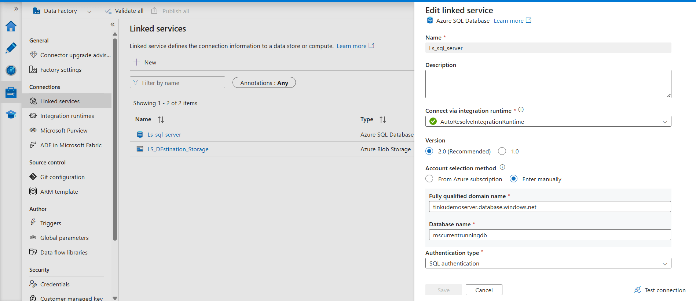


### 2b. Azure Data Lake Storage Gen2
1. **+ New** → Azure Data Lake Storage Gen2
2. Name: `LS_ADLS`
3. Select storage account → **Test** → **Create**

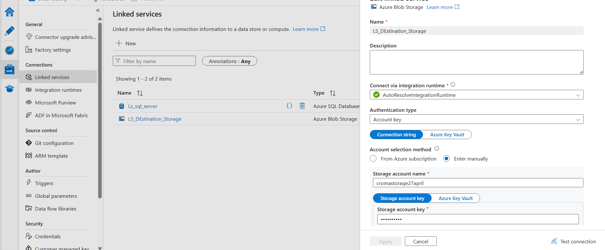

---

## 📦 Step 3: Create Datasets

### 3a. Source — SQL Orders 

1. **Author** → **Datasets** → **+ New** → Azure SQL Database
2. Name: `DS_SQL_Orders`
3. Linked Service: `LS_AzureSqlDB`
4. Table: `dbo.Orders`
5. **Publish All**

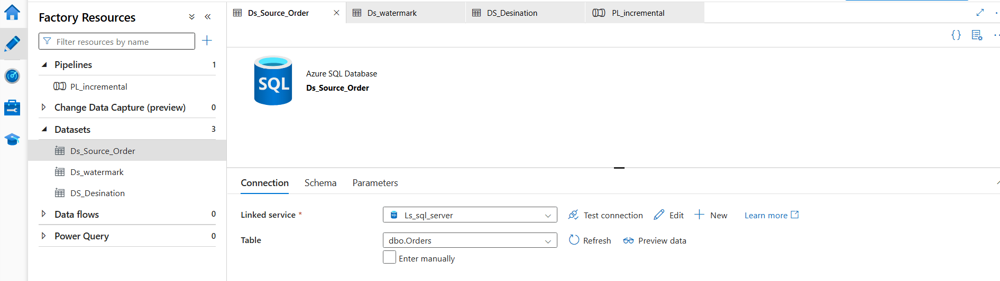

### 3b. Source — Watermark Control Table

1. **+ New** → Azure SQL Database
2. Name: `DS_SQL_Watermark`
3. Linked Service: `LS_AzureSqlDB`
4. Table: `dbo.WatermarkTable`
5. **Publish All**

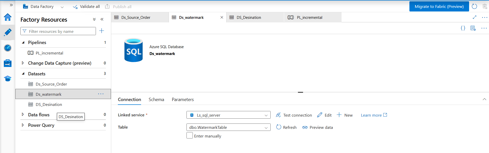


### 3c. Sink — ADLS Parquet (parameterized)

1. **+ New** → Azure Data Lake Storage Gen2 → **Parquet**
2. Name: `DS_ADLS_DeltaParquet`
3. Linked Service: `LS_ADLS`
4. **Parameters tab** → Add: `fileName` | Type: `String`
5. **Connection tab** → File path:
   - Container: `incremental`
   - Directory: `orders_delta`
   - File: `@dataset().fileName`
6. **Publish All**

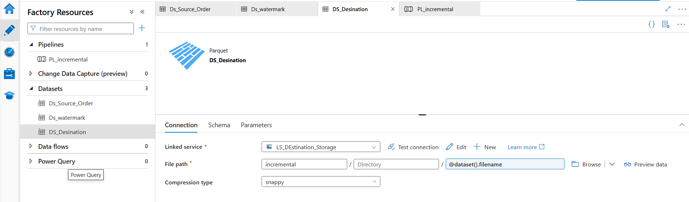
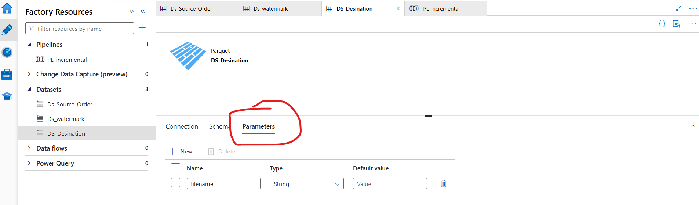


---

## 🔍 Step 4: Lookup Activity — Get Old Watermark

1. **Author** → **Pipelines** → **+ New Pipeline**
2. Name: `PL_Incremental_Copy`
3. Drag **Lookup** onto the canvas
4. Name it `LKP_GetOldWatermark`
5. **Settings tab:**
   - Source dataset: `DS_SQL_Watermark`
   - Use query: **Query**
   - Query:
     ```sql
     SELECT WatermarkValue AS OldWatermark
     FROM   dbo.WatermarkTable
     WHERE  TableName = 'dbo.Orders'
     ```
   - ✅ **First row only:** CHECKED (we expect exactly one row)

**Output reference:** `@activity('LKP_GetOldWatermark').output.firstRow.OldWatermark`

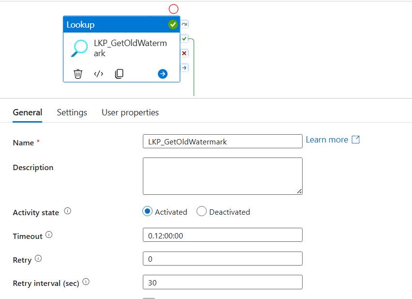
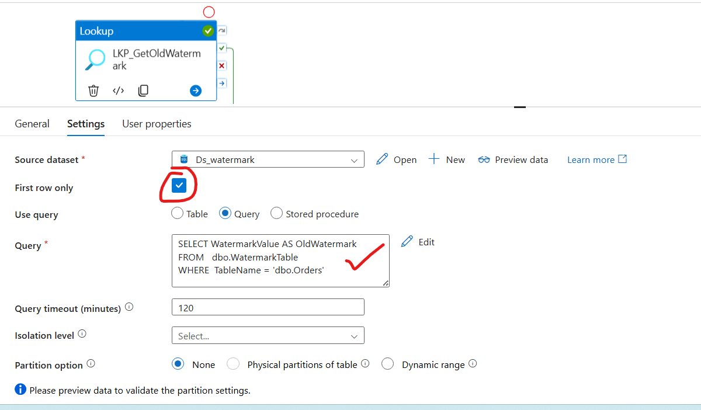


---

## 🔍 Step 5: Lookup Activity — Get New Watermark

1. Drag a second **Lookup** onto the canvas
2. Name it `LKP_GetNewWatermark`
3. Draw a **Success** arrow: `LKP_GetOldWatermark` → `LKP_GetNewWatermark`
4. **Settings tab:**
   - Source dataset: `DS_SQL_Orders`
   - Use query: **Query**
   - Query:
     ```sql
     SELECT MAX(ModifiedDate) AS NewWatermark
     FROM   dbo.Orders
     ```
   - ✅ **First row only:** CHECKED

**Output reference:** `@activity('LKP_GetNewWatermark').output.firstRow.NewWatermark`

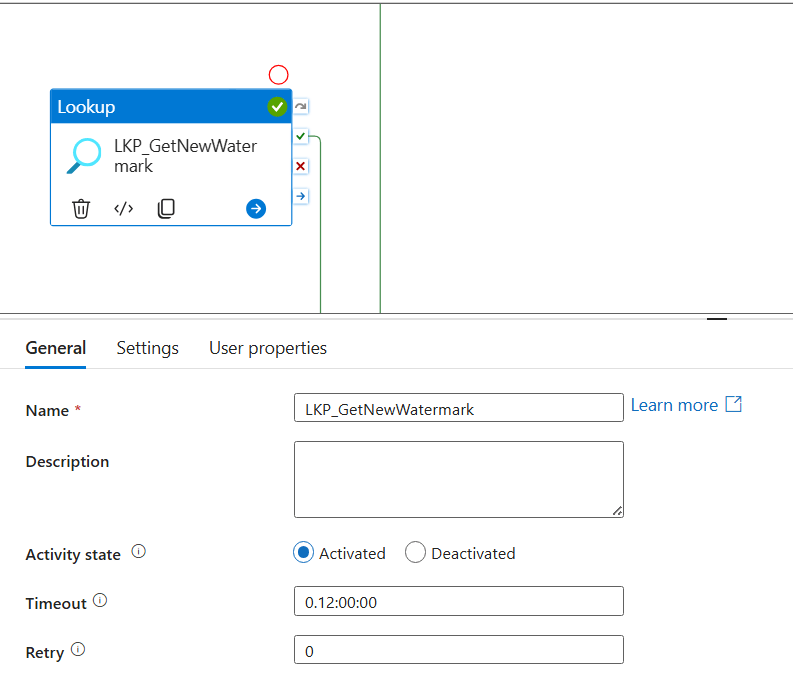
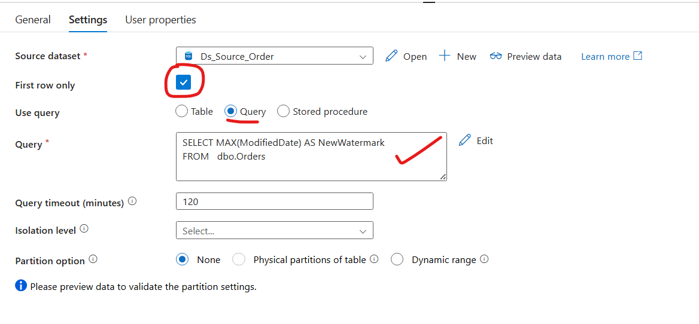


---

## 📋 Step 6: Copy Activity — Delta Rows Only

1. Drag **Copy Data** onto the canvas
2. Name it `CPY_DeltaRows`
3. Draw a **Success** arrow: `LKP_GetNewWatermark` → `CPY_DeltaRows`

### Source Tab:
- Dataset: `DS_SQL_Orders`
- Use query: **Query**
- Query — click **Add dynamic content** and enter:


```
SELECT *
FROM   dbo.Orders
WHERE  ModifiedDate > '@{activity('LKP_GetOldWatermark').output.firstRow.OldWatermark}'
AND    ModifiedDate <= '@{activity('LKP_GetNewWatermark').output.firstRow.NewWatermark}'
ORDER  BY ModifiedDate ASC
```
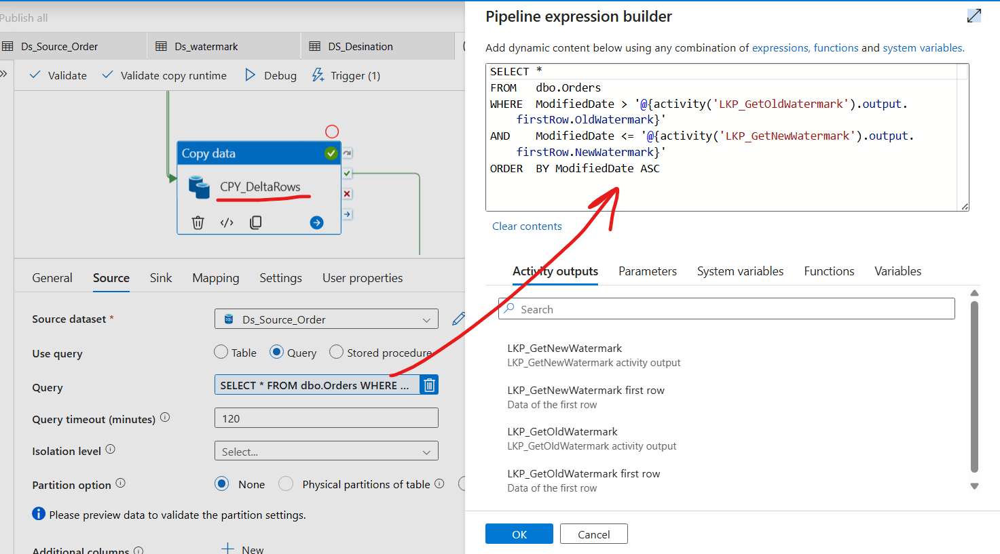


### Sink Tab:
- Dataset: `DS_ADLS_DeltaParquet`
- Dataset properties:
  - `fileName` → Add dynamic content:
    ```
    orders_@{formatDateTime(activity('LKP_GetNewWatermark').output.firstRow.NewWatermark,'yyyyMMdd_HHmmss')}.parquet
    ```
- **Copy behavior:** Append

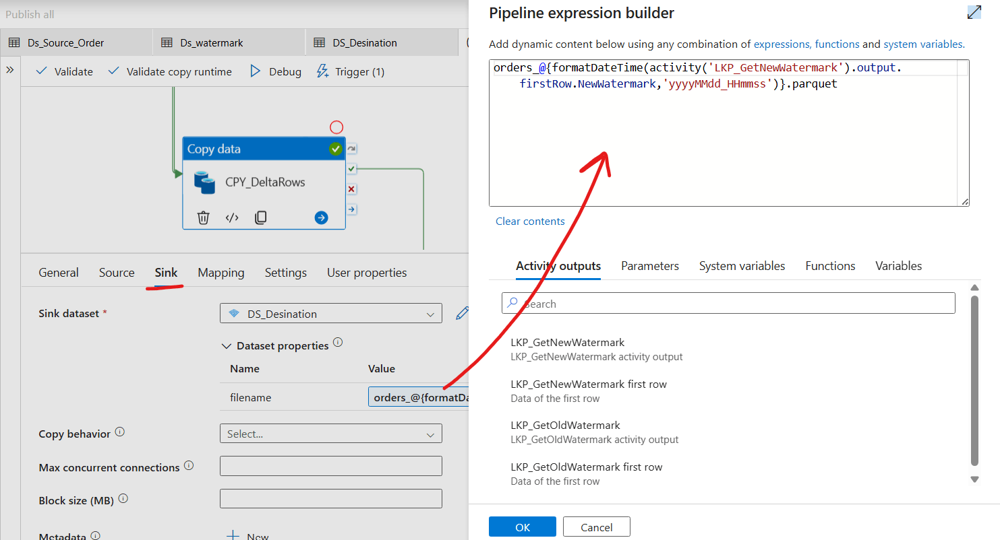


### Settings Tab:
- Enable **Fault tolerance** → Skip incompatible rows
- Set **Retry:** 2, **Retry interval:** 30 seconds

---

## ⚙️ Step 7: Stored Procedure Activity — Update Watermark

1. Drag **Stored Procedure** activity onto the canvas
2. Name it `SP_UpdateWatermark`
3. Draw a **Success** arrow: `CPY_DeltaRows` → `SP_UpdateWatermark`
4. **Settings tab:**
   - Linked Service: `LS_AzureSqlDB`
   - Stored procedure name: `[dbo].[usp_UpdateWatermark]`
   - **Stored procedure parameters** → click **Import** then set:


| Name | Type | Value (dynamic content) |
|---|---|---|
| `TableName` | String | `dbo.Orders` |
| `NewWatermark` | DateTime | `@activity('LKP_GetNewWatermark').output.firstRow.NewWatermark` |

> ✅ This is the critical step — if this activity fails, the watermark is NOT updated, so the next run will safely re-copy the same delta. This gives you **at-least-once delivery** guarantees.

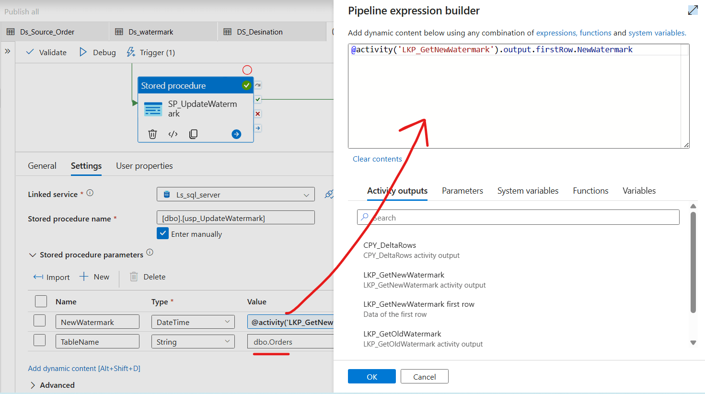

---

## 🔀 Step 8: Add Failure Alert (Web Activity)

1. Drag **Web Activity** onto the canvas
2. Name it `WEB_AlertOnFailure`
3. Draw a **Failure** arrow from `CPY_DeltaRows` → `WEB_AlertOnFailure`
4. Draw a **Failure** arrow from `SP_UpdateWatermark` → `WEB_AlertOnFailure`
5. **Settings tab:**
   - URL: your Teams webhook URL
   - Method: POST
   - Headers: `Content-Type` = `application/json`
   - Body (Add dynamic content):

```
@json(concat(
  '{',
    '"pipelineName":"', pipeline().Pipeline, '",',
    '"runId":"',        pipeline().RunId,    '",',
    '"status":"Failed",',
    '"errorMessage":"', activity('CPY_DeltaRows').Error.message, '",',
    '"loggedAt":"',     utcNow(), '"',
  '}'
))
```

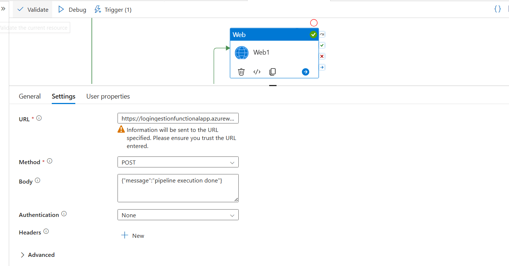


---

## ⏱️ Step 9: Add Schedule Trigger

1. Click **Add trigger** → **New/Edit**
2. Name: `TRG_Daily_Incremental`
3. Type: **Schedule**
4. Start: `2026-04-21 02:00:00 UTC`
5. Recurrence: **Every 1 day**
6. **Publish All**

---

## 🧪 Step 10: Debug — Simulate 3 Runs

### Run 1 — Full initial load

**Before:** `WatermarkTable.WatermarkValue = '1900-01-01'`

1. Click **Debug** → confirm no parameters needed
2. Expected results:
   - `LKP_GetOldWatermark` → `1900-01-01 00:00:00`
   - `LKP_GetNewWatermark` → `2026-04-20 17:00:00`
   - `CPY_DeltaRows` → **10 rows copied** (all rows since 1900)
   - `SP_UpdateWatermark` → WatermarkValue updated to `2026-04-20 17:00:00`
3. Verify in ADLS: `incremental/orders_delta/orders_20260420_170000.parquet`

**After:** `WatermarkTable.WatermarkValue = '2026-04-20 17:00:00'`

---

### Run 2 — Delta (after running Part 3 of SQL script)

**Before:** `WatermarkTable.WatermarkValue = '2026-04-20 17:00:00'`

1. Run Part 3 of the SQL script (inserts 3 new + updates 2 existing)
2. Click **Debug** again
3. Expected results:
   - `LKP_GetOldWatermark` → `2026-04-20 17:00:00`
   - `LKP_GetNewWatermark` → `2026-04-21 14:30:00`
   - `CPY_DeltaRows` → **5 rows copied**

| OrderId | What changed | ModifiedDate |
|---|---|---|
| 6 | Status: Processing → Shipped | 2026-04-21 10:00:00 |
| 11 | NEW — Dell XPS Laptop | 2026-04-21 08:20:00 |
| 12 | NEW — Cashmere Sweater | 2026-04-21 09:45:00 |
| 13 | NEW — Velvet Armchair | 2026-04-21 11:00:00 |
| 9 | Status: Pending → Completed | 2026-04-21 14:30:00 |

4. `SP_UpdateWatermark` → WatermarkValue updated to `2026-04-21 14:30:00`

**After:** `WatermarkTable.WatermarkValue = '2026-04-21 14:30:00'`

---

### Run 3 — Delta (after running Part 4 of SQL script)

**Before:** `WatermarkTable.WatermarkValue = '2026-04-21 14:30:00'`

1. Run Part 4 of the SQL script
2. Click **Debug** again
3. Expected results:
   - `CPY_DeltaRows` → **3 rows copied**

| OrderId | What changed | ModifiedDate |
|---|---|---|
| 14 | NEW — Anker USB-C Hub | 2026-04-22 09:10:00 |
| 15 | NEW — Walnut Writing Desk | 2026-04-22 13:00:00 |
| 11 | Status: Pending → Cancelled | 2026-04-22 15:00:00 |

**After:** `WatermarkTable.WatermarkValue = '2026-04-22 15:00:00'`

---

## 📊 Watermark State Across All Runs

```
WatermarkTable State
════════════════════════════════════════════════════════════

Before Run 1:  1900-01-01 00:00:00   (seed value)
                       │
                       ↓  10 rows copied
After Run 1:   2026-04-20 17:00:00
                       │
                       ↓  5 rows copied
After Run 2:   2026-04-21 14:30:00
                       │
                       ↓  3 rows copied
After Run 3:   2026-04-22 15:00:00
```

---

## 🔑 Key ADF Expression Reference

| Expression | Returns |
|---|---|
| `@activity('LKP_GetOldWatermark').output.firstRow.OldWatermark` | Previous run's high watermark |
| `@activity('LKP_GetNewWatermark').output.firstRow.NewWatermark` | Current run's MAX timestamp |
| `@activity('CPY_DeltaRows').output.rowsCopied` | Number of delta rows copied |
| `@activity('CPY_DeltaRows').output.rowsRead` | Number of rows read from source |
| `@formatDateTime(utcNow(),'yyyyMMdd_HHmmss')` | Timestamp for output file name |

---

## 🚨 Common Pitfalls to Avoid

| Pitfall | Impact | Fix |
|---|---|---|
| **No index on ModifiedDate** | Full table scan every run — slow | Always create `IX_Orders_ModifiedDate` |
| **Updating watermark before copy succeeds** | Data loss on failure | Always use **Success** arrow from Copy to SP |
| **Using `>=` instead of `>`** for old watermark | Last row of previous run copied again (duplicate) | Always use `> OldWatermark` (strict greater than) |
| **Using `>` instead of `<=`** for new watermark | Rows inserted mid-run may be missed | Always use `<= NewWatermark` |
| **Deletes not captured** | Hard-deletes are invisible to watermark pattern | Add a soft-delete `IsDeleted` flag + include in delta query |
| **Clock skew across app servers** | Records with slightly old timestamps missed | Add 5-min buffer: `LKP_GetNewWatermark` uses `DATEADD(MINUTE,-5,MAX(ModifiedDate))` |

---

## 💡 Extension Ideas

| Enhancement | How |
|---|---|
| **Capture deletes** | Add `IsDeleted BIT` + `DeletedDate DATETIME2` to source; include in watermark filter |
| **Multiple tables** | Add a `TableName` row per table in `WatermarkTable`; wrap pipeline in ForEach |
| **Idempotent sink** | Use `MERGE` in sink SQL table instead of append — safe on re-runs |
| **Partition sink by date** | Change file name to `orders_delta/year=2026/month=04/day=21/*.parquet` |
| **Monitor lag** | Add `DATEDIFF(HOUR, WatermarkValue, SYSUTCDATETIME())` alert if lag > 25 hours |
| **Change Data Capture (CDC)** | Replace watermark with SQL Server CDC or Azure SQL Change Tracking for sub-second latency |

---

*Generated for Azure Data Factory v2 · April 2026*
