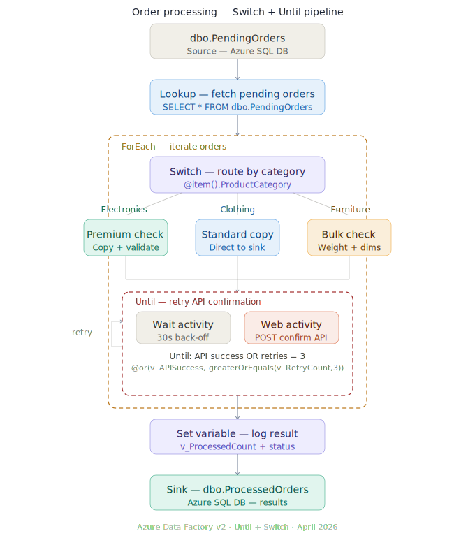

# Azure Data Factory — Until & Switch Activity Demo

---

## 📌 Scenario Overview

**Scenario: Order Processing Pipeline with Category Routing and API Retry**

A retail company receives mixed-category orders (Electronics, Clothing, Furniture) into `dbo.PendingOrders`. Each category needs different processing logic. High-value orders (Electronics and premium Furniture) also require confirmation from an external shipping API that may occasionally fail.  [Download SQL Scripts](adf_until_switch.sql)

| ADF Activity | Role in this pipeline |
|---|---|
| **Switch** | Routes each order to the correct branch based on `ProductCategory` |
| **Until** | Retries the shipping API call up to 3 times with 30-second back-off |

**Switch branches:**

| Case | Condition | Action |
|---|---|---|
| `Electronics` | Category = Electronics | Premium validation + Copy |
| `Clothing` | Category = Clothing | Standard direct copy |
| `Furniture` | Category = Furniture | Bulk dimensions check + Copy |
| `Default` | Anything else | Log and skip |

**Until loop exits when:**
- API returns success (`v_APISuccess = true`), **OR**
- Retry count reaches 3 (`v_RetryCount >= 3`)

---

## 🏗️ Architecture Overview

```
[dbo.PendingOrders — 10 orders, 4 categories]
              │
         Lookup activity
              │
    ForEach — iterate each order
              │
        ┌─────▼──────┐
        │   Switch   │  @item().ProductCategory
        └─────┬──────┘
    ┌─────────┼──────────┐
    │         │          │
Electronics Clothing  Furniture   Default
Premium     Standard  Bulk        Skip
Check       Copy      Check
    └─────────┼──────────┘
              │
    ┌─────────▼──────────────┐
    │  Until (retry loop)    │  only if RequiresAPIConfirm=1
    │  ┌──────┐  ┌────────┐  │
    │  │ Wait │→ │  Web   │  │
    │  │ 30s  │  │ API    │  │
    │  └──────┘  └────────┘  │
    │  exit: success OR ≥3   │
    └─────────┬──────────────┘
              │
    Set Variable + Stored Procedure
              │
    [dbo.ProcessedOrders — sink]
```

---



## ✅ Prerequisites

- **Azure Data Factory** (v2)
- **Azure SQL Database** — run `adf_until_switch.sql` first
- **External HTTP endpoint** — for Until Web activity (use https://httpbin.org/status/200 for testing)
- Linked Services: `LS_AzureSqlDB`

---

## 🗄️ Step 1: Run the SQL Setup Script

Execute `adf_until_switch.sql` in your Azure SQL Database:

| Part | Creates |
|---|---|
| 1 | `dbo.PendingOrders` + 10 sample rows (3 Electronics, 3 Clothing, 3 Furniture, 1 Accessories) |
| 2 | `dbo.ProcessedOrders` sink table |
| 3 | `dbo.APIRetryLog` retry audit table |
| 4 | `dbo.usp_MarkOrderProcessed` stored procedure |
| 5 | Helper verification queries |

**Verify the setup:**
```sql
-- Should return 4 rows: Electronics(3), Clothing(3), Furniture(3), Accessories(1)
SELECT ProductCategory, COUNT(*) AS Orders,
       SUM(CASE WHEN RequiresAPIConfirm=1 THEN 1 ELSE 0 END) AS NeedAPIConfirm
FROM dbo.PendingOrders
GROUP BY ProductCategory;
```

Expected: 4 orders will trigger the Until retry loop (2 Electronics + 2 Furniture marked `RequiresAPIConfirm=1`).

---

## 🔗 Step 2: Create Linked Services and Datasets

### Linked Services
- `LS_AzureSqlDB` → Azure SQL Database (as per previous guides)

### Datasets

| Dataset | Type | Table / Path |
|---|---|---|
| `DS_SQL_PendingOrders` | Azure SQL | `dbo.PendingOrders` |
| `DS_SQL_ProcessedOrders` | Azure SQL | `dbo.ProcessedOrders` |

---

## 🧩 Step 3: Create Pipeline Variables

Before adding activities, define these pipeline variables.
Go to the pipeline canvas background → **Variables** tab → **+ New** for each:

| Variable Name | Type | Default Value | Purpose |
|---|---|---|---|
| `v_APISuccess` | Boolean | `false` | Tracks if API call succeeded in Until |
| `v_RetryCount` | Integer | `0` | Counts retry attempts in Until |
| `v_SwitchBranch` | String | `` | Records which Switch branch handled the order |
| `v_ProcessedCount` | Integer | `0` | Running count of processed orders |

---

## 🔍 Step 4: Add Lookup Activity

1. New pipeline: `PL_Until_Switch_Demo`
2. Drag **Lookup** onto canvas → Name: `LKP_FetchPendingOrders`
3. **Settings:**
   - Dataset: `DS_SQL_PendingOrders`
   - Use query: **Query**
   - Query:
     ```sql
     SELECT *
     FROM   dbo.PendingOrders
     WHERE  Status = 'Pending'
     ORDER  BY Priority DESC, OrderId ASC
     ```
   - ✅ **First row only:** UNCHECKED (we want all pending orders)

---

## 🔄 Step 5: Add ForEach Activity

1. Drag **ForEach** → Name: `FE_IterateOrders`
2. Success arrow: `LKP_FetchPendingOrders` → `FE_IterateOrders`
3. **Settings:**
   - Sequential: **ON** (process one order at a time — avoids DB locking)
   - Items → Add dynamic content:
     ```
     @activity('LKP_FetchPendingOrders').output.value
     ```
4. Click **pencil ✏️** to open the ForEach inner canvas

---

## 🔀 Step 6: Add Switch Activity (inside ForEach)

1. Drag **Switch** onto the inner canvas → Name: `SW_RouteByCategory`
2. **Activities tab → On expression** → Add dynamic content:
   ```
   @item().ProductCategory
   ```

### 6a. Add Cases to the Switch

Click **+ Add case** for each:

#### Case 1 — `Electronics`

1. Case value: `Electronics`
2. Click the pencil icon on the Electronics case
3. Add **Copy Data** activity → Name: `CPY_Electronics`
   - **Source:** `DS_SQL_PendingOrders` with query:
     ```sql
     SELECT *, 'PremiumValidated' AS ValidationStatus
     FROM   dbo.PendingOrders
     WHERE  OrderId = @{item().OrderId}
     ```
   - **Sink:** `DS_SQL_ProcessedOrders`
4. After Copy, add **Set Variable** → Name: `SV_Branch_Electronics`
   - Variable: `v_SwitchBranch` | Value: `Electronics-Premium`
5. Go back ←

#### Case 2 — `Clothing`

1. Case value: `Clothing`
2. Add **Copy Data** → Name: `CPY_Clothing`
   - Source query:
     ```sql
     SELECT * FROM dbo.PendingOrders WHERE OrderId = @{item().OrderId}
     ```
   - Sink: `DS_SQL_ProcessedOrders`
3. Add **Set Variable** → `v_SwitchBranch` = `Clothing-Standard`
4. Go back ←

#### Case 3 — `Furniture`

1. Case value: `Furniture`
2. Add **Copy Data** → Name: `CPY_Furniture`
   - Source query:
     ```sql
     SELECT *, 'BulkChecked' AS FulfillmentNote
     FROM   dbo.PendingOrders
     WHERE  OrderId = @{item().OrderId}
     ```
   - Sink: `DS_SQL_ProcessedOrders`
3. Add **Set Variable** → `v_SwitchBranch` = `Furniture-Bulk`
4. Go back ←

#### Default Case

1. Click **Default** tab
2. Add **Web Activity** → Name: `WEB_LogUnknownCategory`
   - URL: `https://httpbin.org/post`
   - Method: POST
   - Body (Add dynamic content):
     ```
     @json(concat(
       '{',
         '"message":"Unknown category - skipped",',
         '"orderId":"', string(item().OrderId), '",',
         '"category":"', item().ProductCategory, '"',
       '}'
     ))
     ```
3. Go back ←

---

## 🔁 Step 7: Add Until Activity (inside ForEach, after Switch)

The Until loop handles the external API confirmation for orders where `RequiresAPIConfirm = 1`.

### 7a. Add an If Condition before Until (gate)

1. On the ForEach inner canvas, drag **If Condition** → Name: `IF_NeedsAPIConfirm`
2. Success arrow: `SW_RouteByCategory` → `IF_NeedsAPIConfirm`
3. **Activities tab → Expression:**
   ```
   @equals(item().RequiresAPIConfirm, true)
   ```

#### TRUE branch (order needs API confirmation):

1. Open TRUE canvas → drag **Until** → Name: `UNTIL_APIConfirmed`
2. **Settings → Condition** → Add dynamic content:
   ```
   @or(
       variables('v_APISuccess'),
       greaterOrEquals(variables('v_RetryCount'), 3)
   )
   ```
3. Set **Timeout:** `00:05:00` (5 minutes max — safety net)

#### Inside the Until canvas:

**Activity 1 — Set Variable (increment retry counter)**
- Name: `SV_IncrementRetry`
- Variable: `v_RetryCount`
- Value → Add dynamic content:
  ```
  @add(variables('v_RetryCount'), 1)
  ```

**Activity 2 — Wait activity** (after `SV_IncrementRetry`)
- Name: `WT_Backoff`
- Wait time in seconds → Add dynamic content:
  ```
  @mul(variables('v_RetryCount'), 30)
  ```
  > This gives **30s, 60s, 90s** back-off on attempts 1, 2, 3.

**Activity 3 — Web activity** (after `WT_Backoff`)
- Name: `WEB_CallConfirmAPI`
- URL: `https://httpbin.org/post` (replace with your real API)
- Method: POST
- Headers: `Content-Type` = `application/json`
- Body → Add dynamic content:
  ```
  @json(concat(
    '{',
      '"orderId":"',    string(item().OrderId), '",',
      '"sku":"',        item().SKU, '",',
      '"region":"',     item().Region, '",',
      '"totalAmount":"',string(item().TotalAmount), '"',
    '}'
  ))
  ```

**Activity 4 — Set Variable** (after `WEB_CallConfirmAPI`, success arrow)
- Name: `SV_APISuccess`
- Variable: `v_APISuccess`
- Value: `true`

**Activity 5 — Set Variable** (after `WEB_CallConfirmAPI`, failure arrow)
- Name: `SV_APIFailed`
- Variable: `v_APISuccess`
- Value: `false`

Go back ← to the If Condition canvas, then back ← to the ForEach canvas.

#### FALSE branch (no API confirmation needed):

1. Open FALSE canvas
2. Drag **Set Variable** → Name: `SV_NoAPINeeded`
3. Variable: `v_APISuccess` | Value: `true`
4. Go back ←

---

## ⚙️ Step 8: Add Stored Procedure Activity (inside ForEach)

After the `IF_NeedsAPIConfirm` completes (both TRUE and FALSE branches merge here):

1. Drag **Stored Procedure** → Name: `SP_MarkProcessed`
2. Success arrow: `IF_NeedsAPIConfirm` → `SP_MarkProcessed`
3. **Settings:**
   - Linked Service: `LS_AzureSqlDB`
   - Stored procedure: `[dbo].[usp_MarkOrderProcessed]`
   - Parameters:

| Parameter | Type | Value (dynamic content) |
|---|---|---|
| `OrderId` | Int32 | `@item().OrderId` |
| `SwitchBranch` | String | `@variables('v_SwitchBranch')` |
| `APIConfirmed` | Boolean | `@variables('v_APISuccess')` |
| `APIRetries` | Int32 | `@variables('v_RetryCount')` |
| `ProcessStatus` | String | `@if(variables('v_APISuccess'),'Success','MaxRetriesReached')` |

4. Go back ← to the main pipeline canvas.

---

## ▶️ Step 9: Debug and Validate

### Debug Steps

1. Click **Debug** in the main pipeline toolbar
2. Watch the **Output** panel — ForEach will show 10 iterations

### Expected per-order behaviour

| OrderId | Category | Branch | API Confirm? | Until Fires? |
|---|---|---|---|---|
| 1 | Electronics | Premium check | ✅ Yes | ✅ Yes |
| 2 | Electronics | Premium check | ✅ Yes | ✅ Yes |
| 3 | Electronics | Premium check | ❌ No | ❌ No |
| 4 | Clothing | Standard copy | ❌ No | ❌ No |
| 5 | Clothing | Standard copy | ❌ No | ❌ No |
| 6 | Clothing | Standard copy | ❌ No | ❌ No |
| 7 | Furniture | Bulk check | ✅ Yes | ✅ Yes |
| 8 | Furniture | Bulk check | ✅ Yes | ✅ Yes |
| 9 | Furniture | Bulk check | ❌ No | ❌ No |
| 10 | Accessories | Default | ❌ No | ❌ No |

### Verify results

```sql
-- All 10 orders should be processed
SELECT ProcessStatus, SwitchBranch, COUNT(*) AS Cnt,
       SUM(CAST(APIConfirmed AS INT)) AS Confirmed,
       MAX(APIRetries) AS MaxRetries
FROM   dbo.ProcessedOrders
GROUP  BY ProcessStatus, SwitchBranch
ORDER  BY SwitchBranch;

-- Until retry audit
SELECT OrderId, AttemptNumber, HTTPStatus, IsSuccess, WaitSeconds
FROM   dbo.APIRetryLog
ORDER  BY OrderId, AttemptNumber;
```

---

## 🔑 Key Expression Reference

### Switch activity

| Expression | Purpose |
|---|---|
| `@item().ProductCategory` | The `on()` value the Switch evaluates |
| `@equals(item().ProductCategory,'Electronics')` | Condition inside If (if using If instead of Switch) |

### Until activity

| Expression | Purpose |
|---|---|
| `@or(variables('v_APISuccess'), greaterOrEquals(variables('v_RetryCount'),3))` | Exit condition |
| `@add(variables('v_RetryCount'),1)` | Increment retry counter |
| `@mul(variables('v_RetryCount'),30)` | Exponential back-off in seconds |
| `@activity('WEB_CallConfirmAPI').output.statusCode` | HTTP status from Web activity |
| `@equals(activity('WEB_CallConfirmAPI').output.statusCode,200)` | Success check |

---

## ⚠️ Key Differences: Switch vs If Condition

| Feature | Switch | If Condition |
|---|---|---|
| Number of branches | Unlimited cases + Default | Exactly 2 (True / False) |
| Expression type | Single `on()` value matched to cases | Boolean expression |
| Best for | Routing by category/type/code | Binary yes/no decisions |
| Case matching | Exact string match | Any boolean expression |
| Default branch | ✅ Built-in | ❌ Must chain multiple Ifs |

---

## 🚨 Common Pitfalls to Avoid

| Pitfall | Problem | Fix |
|---|---|---|
| **No timeout on Until** | Loop runs forever if API never responds | Always set Timeout (e.g., `00:05:00`) |
| **Reset variables between iterations** | `v_RetryCount` carries over to the next ForEach item | Add Set Variable (value=0 and value=false) at the START of ForEach before Switch |
| **Switch case is case-sensitive** | `Electronics` ≠ `electronics` | Normalize with `@toUpper(item().ProductCategory)` in the on() expression |
| **Parallel ForEach with Until** | Shared pipeline variables cause race conditions | Set ForEach **Sequential = ON** when using Until with pipeline variables |
| **Web activity always succeeds** | Even 4xx/5xx HTTP responses mark Web activity as Succeeded | Check `@activity('WEB_...').output.statusCode` explicitly inside Until |

---

## 💡 Extension Ideas

| Enhancement | How |
|---|---|
| **Email on max retries** | Add Web Activity in Until's exit path — check `v_RetryCount >= 3` with If Condition |
| **Dynamic back-off** | Change Wait to `@mul(pow(2,variables('v_RetryCount')),15)` for true exponential (15s, 30s, 60s) |
| **More Switch cases** | Add `Accessories`, `Sports`, `Books` cases without changing the Until logic |
| **Parallel processing** | Turn ForEach Sequential OFF + use row-level locking in the stored procedure |
| **Switch on priority** | Change `on()` to `@item().Priority` to route High/Standard/Low to different SLAs |

---

*Generated for Azure Data Factory v2 · April 2026*
