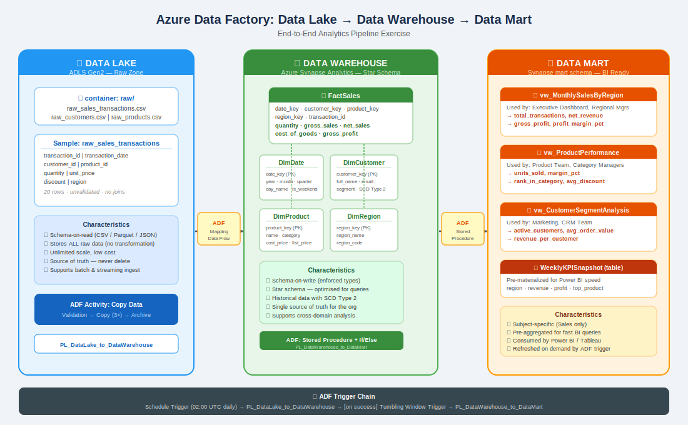

# Azure Data Factory Exercise
## Data Lake → Data Warehouse → Data Mart

> **Skill Level:** Beginner–Intermediate  
> **Estimated Time:** 3–4 hours  
> **Azure Services Used:** Azure Data Lake Storage Gen2, Azure Data Factory, Azure Synapse Analytics (or Azure SQL Database)

---

## 📋 Table of Contents

1. [Overview & Learning Objectives](#overview)
2. [Architecture Diagram](#architecture)
3. [Prerequisites & Azure Setup](#prerequisites)
4. [Sample Data Reference](#sample-data)
5. [Part 1 — Data Lake (Raw Ingestion)](#part-1)
6. [Part 2 — Data Warehouse (Star Schema)](#part-2)
7. [Part 3 — Data Mart (BI Layer)](#part-3)
8. [ADF Pipeline Walkthrough](#pipelines)
9. [Testing & Validation Queries](#validation)
10. [Concepts Summary](#concepts)

---

## 1. Overview & Learning Objectives {#overview}

This exercise simulates a real-world retail analytics scenario. You work for a fictional electronics retailer. Raw sales transactions arrive daily as CSV files in cloud storage. Your job is to build an end-to-end ADF pipeline that:

| Stage | What happens | Azure resource |
|---|---|---|
| **Data Lake** | Store raw CSV files as-is; no transformation | ADLS Gen2 |
| **Data Warehouse** | Clean, transform, and load a Star Schema | Azure Synapse (SQL Pool) |
| **Data Mart** | Aggregate into BI-ready views/tables | Synapse `mart` schema |

**After completing this exercise you will be able to:**

- Explain the purpose and difference between a Data Lake, Data Warehouse, and Data Mart
- Build an ADF pipeline using Copy, Mapping Data Flow, Stored Procedure, and If/Else activities
- Design a Star Schema with Fact and Dimension tables
- Create pre-aggregated mart views consumed by Power BI or Tableau
- Chain two ADF pipelines using a success trigger

---

## 2. Architecture Diagram {#architecture}

```
See: diagrams/architecture.svg
(Open in any browser)
```

```
┌─────────────────┐      ADF Copy        ┌──────────────────────┐    ADF Stored Proc    ┌────────────────────┐
│   DATA LAKE      │  ──────────────────► │   DATA WAREHOUSE     │  ──────────────────►  │    DATA MART       │
│  ADLS Gen2       │   Mapping Data Flow  │  Azure Synapse       │                        │  mart schema       │
│                  │                      │  Star Schema         │                        │                    │
│ raw_sales_*.csv  │                      │  FactSales           │                        │ MonthlySalesByReg  │
│ raw_customers.csv│                      │  DimCustomer (SCD2)  │                        │ ProductPerformance │
│ raw_products.csv │                      │  DimProduct          │                        │ CustomerSegment    │
│                  │                      │  DimDate             │                        │ WeeklyKPISnapshot  │
│ Schema-on-read   │                      │  DimRegion           │                        │ Power BI / Tableau │
│ All raw data kept│                      │  Schema-on-write     │                        │ Pre-aggregated     │
└─────────────────┘                       └──────────────────────┘                        └────────────────────┘
         ↑
  Schedule Trigger
  Daily 02:00 UTC
```



---

## 3. Prerequisites & Azure Setup {#prerequisites}

### Required Resources

Create these in the Azure portal before starting:

```
1. Resource Group:      rg-adf-exercise
2. Storage Account:     stadlsexercise01   (enable Hierarchical Namespace = Data Lake Gen2)
3. Azure Data Factory:  adf-exercise-01
4. Azure Synapse / SQL: synapse-exercise-01  (Serverless SQL Pool is free-tier friendly)
```

### ADLS Gen2 — Container & Folder Structure

```
container: sales-data/
├── raw/                        ← upload CSV files here
│   ├── raw_sales_transactions.csv
│   ├── raw_customers.csv
│   └── raw_products.csv
├── archive/                    ← ADF moves processed files here
│   └── 2024/01/15/             ← date-partitioned
└── mart-export/                ← optional Power BI CSV exports
```
Download Sample CSV data  - [raw_customers.csv](sample_data/raw_customers.csv)   | [raw_products.csv](sample_data/raw_products.csv) | [raw_sales_transactions.csv](sample_data/raw_sales_transactions.csv)


### ADF Linked Services to Create

| Name | Type | Points to |
|---|---|---|
| `LS_ADLS_Gen2` | Azure Data Lake Storage Gen2 | `stadlsexercise01` |
| `LS_AzureSynapse` | Azure Synapse Analytics | `synapse-exercise-01` |

### Synapse — Schemas to Create

Run these in Synapse Studio before deploying pipelines:

```sql
CREATE SCHEMA staging;   -- temporary landing for raw data
CREATE SCHEMA dbo;       -- star schema (fact + dimensions)
CREATE SCHEMA mart;      -- pre-aggregated BI layer
CREATE SCHEMA audit;     -- pipeline run logging
```

---

## 4. Sample Data Reference {#sample-data}

All files are in the `sample_data/` folder. Upload them to your ADLS `raw/` container.

Download Sample CSV data  - [raw_customers.csv](sample_data/raw_customers.csv)   | [raw_products.csv](sample_data/raw_products.csv) | [raw_sales_transactions.csv](sample_data/raw_sales_transactions.csv)

### raw_sales_transactions.csv (20 rows)

| Column | Type | Example | Notes |
|---|---|---|---|
| transaction_id | VARCHAR | TXN-001 | Natural key |
| transaction_date | DATE | 2024-01-05 | YYYY-MM-DD |
| customer_id | VARCHAR | C001 | FK → customers |
| product_id | VARCHAR | P101 | FK → products |
| store_id | VARCHAR | S01 | Not used in warehouse (simplification) |
| quantity | INT | 2 | Units purchased |
| unit_price | DECIMAL | 29.99 | List price at time of sale |
| discount | DECIMAL | 0.00 | Dollar discount applied |
| region | VARCHAR | North | North / South / East / West |

### raw_customers.csv (10 rows)

| Column | Notes |
|---|---|
| customer_id | C001–C010 |
| first_name, last_name | — |
| email, phone | — |
| city, state, country | — |
| signup_date | — |
| segment | **Premium / Standard / Basic** — used for mart segmentation |

### raw_products.csv (5 rows)

| Column | Notes |
|---|---|
| product_id | P101–P105 |
| product_name, category, sub_category | — |
| brand | TechBrand / SoundPro / CableCo / EnergyMax |
| cost_price | Used to calculate gross_profit in FactSales |
| list_price | Reference only |
| sku, supplier_id | Stored as attributes in DimProduct |

---

## 5. Part 1 — Data Lake (Raw Ingestion) {#part-1}

### What is a Data Lake?

A Data Lake stores data in its **raw, original format** — no transformation, no schema enforcement. Think of it as a giant file system in the cloud. You pay for cheap storage and process the data later.

> **Key principle:** The Data Lake never deletes or modifies raw data. It is the permanent source of truth.

### Step 1.1 — Upload Sample Files

1. Open Azure Storage Explorer or the Azure Portal.
2. Navigate to `stadlsexercise01` → `sales-data` → `raw/`.
3. Upload all three CSV files from `sample_data/`.

### Step 1.2 — Create ADF Datasets for the Raw Files

In ADF Studio → **Datasets** → New:

**Dataset 1: DS_ADLS_RawTransactions**
```
Type:          DelimitedText
Linked Service: LS_ADLS_Gen2
File path:     sales-data/raw/raw_sales_transactions.csv
First row as header: Yes
```

**Dataset 2: DS_ADLS_RawCustomers**
```
Type:          DelimitedText
Linked Service: LS_ADLS_Gen2
File path:     sales-data/raw/raw_customers.csv
First row as header: Yes
```

**Dataset 3: DS_ADLS_RawProducts**
```
Type:          DelimitedText
Linked Service: LS_ADLS_Gen2
File path:     sales-data/raw/raw_products.csv
First row as header: Yes
```

### Step 1.3 — Verify the Files Exist (Validation Activity)

The first activity in `PL_DataLake_to_DataWarehouse` is a **Validation** activity. It checks that the raw folder is not empty before processing starts.

- **Timeout:** 10 minutes
- **If files are missing:** Pipeline fails early with a clear error message

> 💡 **Why this matters:** In production, files may be delayed. A Validation activity prevents partial loads.

---

## 6. Part 2 — Data Warehouse (Star Schema) {#part-2}

### What is a Data Warehouse?

A Data Warehouse is a **structured, query-optimised** store. Data is cleaned, validated, and loaded into a well-defined schema. The most common design pattern is the **Star Schema**:

```
              DimDate
                 │
   DimProduct ───┤
                 │
   DimCustomer──FactSales──DimRegion
```

- **Fact Table** (`FactSales`) — stores measurable business events (transactions). Contains foreign keys to all dimensions + numeric measures.
- **Dimension Tables** — descriptive context (who, what, when, where).

### Step 2.1 — Run the DDL Script

Execute `sql/01_data_warehouse_ddl.sql` in Synapse Studio. This creates:

| Table | Type | Key columns |
|---|---|---|
| `dbo.DimDate` | Dimension | date_key, year_num, month_num, is_weekend |
| `dbo.DimCustomer` | Dimension (SCD Type 2) | customer_key, segment, is_current |
| `dbo.DimProduct` | Dimension | product_key, cost_price, list_price |
| `dbo.DimRegion` | Dimension | region_key, region_name |
| `dbo.FactSales` | Fact | sale_key, 4 FK keys, measures |

### Step 2.2 — Create the Mapping Data Flow

In ADF Studio → **Data Flows** → New → Name: `DF_Transform_StarSchema`

The Data Flow has these transformations in order:

```
Source: staging.SalesTransactions
    │
    ├── DerivedColumn: Calculate measures
    │     gross_sales  = quantity * unit_price
    │     net_sales    = gross_sales - discount
    │     cost_of_goods = quantity * (lookup cost_price from DimProduct)
    │     gross_profit = net_sales - cost_of_goods
    │
    ├── Lookup: Join to DimCustomer (match on customer_id, is_current=1)
    ├── Lookup: Join to DimProduct  (match on product_id)
    ├── Lookup: Join to DimRegion   (match on region_name)
    ├── DerivedColumn: Convert transaction_date → date_key (yyyyMMdd INT)
    │
    └── Sink: dbo.FactSales (Insert mode)
```

#### SCD Type 2 for DimCustomer

When a customer's `segment` changes (e.g. Basic → Premium), we keep the history:

```
New row:  is_current=1, row_effective_date=today, row_expiry_date=NULL
Old row:  is_current=0, row_expiry_date=today-1
```

In the Data Flow, add an **Alter Row** transformation set to **Upsert** on `customer_id`.

### Step 2.3 — Calculated Measures Reference

| Measure | Formula | Stored in |
|---|---|---|
| `gross_sales` | `quantity × unit_price` | FactSales |
| `net_sales` | `gross_sales − discount` | FactSales |
| `cost_of_goods` | `quantity × DimProduct.cost_price` | FactSales |
| `gross_profit` | `net_sales − cost_of_goods` | FactSales |

> 💡 **Why calculate at load time?** Pre-calculating measures means BI tools read a single column instead of computing it per query — often a 10–100× speed difference at scale.

---

## 7. Part 3 — Data Mart (BI Layer) {#part-3}

### What is a Data Mart?

A Data Mart is a **subject-specific, pre-aggregated** subset of the warehouse. Where the warehouse answers *any* business question, the mart answers *specific* questions for a *specific* team — faster.

| | Data Warehouse | Data Mart |
|---|---|---|
| Scope | Entire organisation | Single subject (Sales) |
| Schema | Star schema (normalised) | Denormalised / aggregated |
| Users | Data engineers, analysts | Business users, BI tools |
| Query speed | Moderate | Very fast |
| Update frequency | Daily | On-demand / daily |

### Step 3.1 — Run the Mart DDL Script

Execute `sql/02_data_mart_ddl.sql`. This creates:

| Object | Type | Purpose |
|---|---|---|
| `mart.vw_MonthlySalesByRegion` | VIEW | Executive dashboard — revenue by region/month |
| `mart.vw_ProductPerformance` | VIEW | Category managers — units, margin, rank |
| `mart.vw_CustomerSegmentAnalysis` | VIEW | Marketing — revenue per segment/month |
| `mart.WeeklyKPISnapshot` | TABLE | Pre-materialised for Power BI import mode |

### Step 3.2 — Understand the Mart Views

**vw_MonthlySalesByRegion** — answers: *"Which region performed best in January?"*
```sql
SELECT region_name, net_revenue, profit_margin_pct
FROM mart.vw_MonthlySalesByRegion
WHERE year_num = 2024 AND month_num = 1
ORDER BY net_revenue DESC;
```

**vw_ProductPerformance** — answers: *"What's our top product by margin in Q1?"*
```sql
SELECT product_name, margin_pct, rank_in_category
FROM mart.vw_ProductPerformance
WHERE year_num = 2024 AND quarter_num = 1
ORDER BY rank_in_category;
```

**vw_CustomerSegmentAnalysis** — answers: *"How much does each segment spend per order?"*
```sql
SELECT segment, avg_order_value, revenue_per_customer
FROM mart.vw_CustomerSegmentAnalysis
WHERE year_num = 2024 AND month_num = 1;
```

---

## 8. ADF Pipeline Walkthrough {#pipelines}

### Pipeline 1: PL_DataLake_to_DataWarehouse

Located in: `adf_pipelines/PL_DataLake_to_DataWarehouse.json`

```
[Validation]
    │ (Succeeded)
    ├── [Copy: Transactions → staging.SalesTransactions]
    ├── [Copy: Customers → staging.Customers]          ← Parallel
    └── [Copy: Products → staging.Products]
              │ (All 3 Succeeded)
         [Mapping Data Flow: DF_Transform_StarSchema]
              │ (Succeeded)
         [Copy: Archive raw files to /archive/date/]
              │ (Succeeded)
         [Stored Procedure: audit.usp_LogPipelineRun]
```

**To import this pipeline into ADF:**
1. ADF Studio → Author → Pipelines → three-dot menu → Import from JSON
2. Select `adf_pipelines/PL_DataLake_to_DataWarehouse.json`
3. Update linked service references to match your environment

### Pipeline 2: PL_DataWarehouse_to_DataMart

Located in: `adf_pipelines/PL_DataWarehouse_to_DataMart.json`

```
[Lookup: COUNT(*) from FactSales for today]
    │
[If Condition: row_count > 0?]
    │
    ├── TRUE branch:
    │     ├── [SP: mart.usp_Refresh_MonthlySalesByRegion]
    │     ├── [SP: mart.usp_Refresh_ProductPerformance]   ← Parallel
    │     ├── [SP: mart.usp_Refresh_CustomerSegmentAnalysis]
    │     │        │ (All 3 Succeeded)
    │     ├── [SP: mart.usp_Insert_WeeklyKPISnapshot]
    │     └── [Copy: Mart CSV export → ADLS mart-export/]
    │
    └── FALSE branch:
          [Web Activity: POST alert to MS Teams webhook]
```

### Trigger Chain Setup

In ADF Studio → Manage → Triggers:

**Trigger 1 — Schedule (daily at 02:00 UTC)**
```
Name:      TRG_Daily_DataLake_Load
Type:      Schedule
Recurrence: Every 1 day at 02:00 UTC
Pipeline:  PL_DataLake_to_DataWarehouse
```

**Trigger 2 — Tumbling Window (runs after Trigger 1 succeeds)**
```
Name:      TRG_Mart_Refresh
Type:      Tumbling Window
Depends on: TRG_Daily_DataLake_Load
Pipeline:  PL_DataWarehouse_to_DataMart
```

---

## 9. Testing & Validation Queries {#validation}

Run these queries in Synapse Studio to verify each stage loaded correctly.

### Validate Stage 1 — Staging tables populated

```sql
-- Should return 20 rows
SELECT COUNT(*) AS staging_rows FROM staging.SalesTransactions;

-- Should return 10 rows
SELECT COUNT(*) AS customer_rows FROM staging.Customers;

-- Should return 5 rows
SELECT COUNT(*) AS product_rows FROM staging.Products;
```

### Validate Stage 2 — Star Schema loaded

```sql
-- Check FactSales totals (should return 20 rows)
SELECT COUNT(*)       AS fact_rows,
       SUM(net_sales) AS total_net_sales,
       SUM(gross_profit) AS total_profit
FROM dbo.FactSales;

-- Expected approximate output:
-- fact_rows: 20
-- total_net_sales: ~2,540
-- total_profit: ~1,700

-- Verify dimension counts
SELECT 'DimCustomer' AS tbl, COUNT(*) AS rows FROM dbo.DimCustomer
UNION ALL
SELECT 'DimProduct',         COUNT(*) FROM dbo.DimProduct
UNION ALL
SELECT 'DimRegion',          COUNT(*) FROM dbo.DimRegion
UNION ALL
SELECT 'DimDate',            COUNT(*) FROM dbo.DimDate;
```

### Validate Stage 3 — Mart layer

```sql
-- Regional revenue summary (4 rows expected)
SELECT region_name,
       total_transactions,
       ROUND(net_revenue, 2)       AS net_revenue,
       ROUND(profit_margin_pct, 1) AS margin_pct
FROM mart.vw_MonthlySalesByRegion
ORDER BY net_revenue DESC;

-- Top product by margin
SELECT product_name, units_sold,
       ROUND(margin_pct, 1) AS margin_pct,
       rank_in_category
FROM mart.vw_ProductPerformance
ORDER BY margin_pct DESC;

-- Customer segment comparison
SELECT segment, active_customers,
       ROUND(avg_order_value, 2)      AS avg_order_value,
       ROUND(revenue_per_customer, 2) AS rev_per_customer
FROM mart.vw_CustomerSegmentAnalysis
ORDER BY avg_order_value DESC;
```

### Expected Results Summary

| Query | Expected |
|---|---|
| Staging rows | 20 transactions, 10 customers, 5 products |
| FactSales rows | 20 |
| Net Revenue (North) | Highest — Alice Johnson + Grace Wilson orders |
| Top margin product | Mechanical Keyboard (P105) ~60% margin |
| Premium avg_order_value | Highest segment spend |

---

## 10. Concepts Summary {#concepts}

### Why three layers?

```
DATA LAKE          → "Keep everything, sort it out later"
DATA WAREHOUSE     → "One version of the truth, structured and auditable"
DATA MART          → "Fast answers for specific teams"
```

### Comparison Table

| Feature | Data Lake | Data Warehouse | Data Mart |
|---|---|---|---|
| Storage format | Raw (CSV, JSON, Parquet) | Structured tables | Views / agg tables |
| Schema | Schema-on-read | Schema-on-write | Derived from DWH |
| Transformation | None | ETL / ELT | Pre-aggregation |
| Typical users | Engineers | Analysts | Business users |
| Query flexibility | High | High | Limited (focused) |
| Query speed | Slow | Fast | Fastest |
| Data scope | All enterprise data | All structured data | Subject-specific |
| History | Full raw history | With SCD2 | Current + period |
| Azure service | ADLS Gen2 | Synapse SQL Pool | Synapse mart schema |

### ADF Activity Types Used

| Activity | Used for |
|---|---|
| **Validation** | Confirm source files exist |
| **Copy** | Move data between stores (Lake → Synapse) |
| **Mapping Data Flow** | Complex transformations, joins, SCD logic |
| **Stored Procedure** | Refresh mart tables |
| **If Condition** | Branch logic (data exists? yes/no) |
| **Lookup** | Read a single value before branching |
| **Web Activity** | Send Teams/Slack alert |

---

## 📁 File Reference

```
adf-exercise/
├── README.md                                    ← This file
├── diagrams/
│   └── architecture.svg                         ← Open in browser
├── sample_data/
│   ├── raw_sales_transactions.csv               ← Upload to ADLS raw/
│   ├── raw_customers.csv
│   └── raw_products.csv
├── sql/
│   ├── 01_data_warehouse_ddl.sql                ← Run in Synapse first
│   └── 02_data_mart_ddl.sql                     ← Run after warehouse
└── adf_pipelines/
    ├── PL_DataLake_to_DataWarehouse.json         ← Import into ADF
    └── PL_DataWarehouse_to_DataMart.json         ← Import into ADF
```

---

*Exercise created for educational purposes. Fictional data only.*
